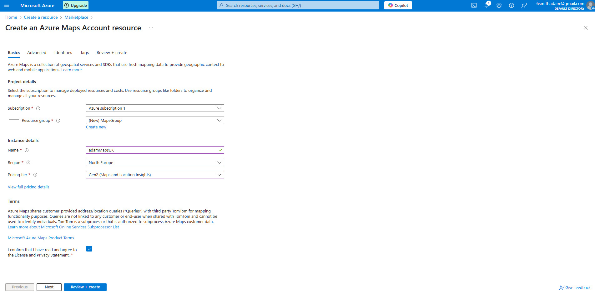

## Getting Started with Azure Maps API

### 1. Sign Up for Azure

- Open an **Incognito/Private** window.
- Go to [https://azure.microsoft.com/free](https://azure.microsoft.com/free).
- Sign in with your existing Microsoft account or create a new one.
- Complete the sign-up process to activate your **Free Trial** (includes £147 credit).
- Azure automatically enables a spending limit equal to your free credit.

### 2. Access the Azure Portal

- After signing up, go to the [Azure Portal](https://portal.azure.com).
- Make sure you're using a **directory** where you have **admin access**.
- You can check or switch directories by clicking your profile icon with '**Switch Directory**'.

### 3. Create an Azure Maps Resource

- In the Azure Portal, click **"Create a resource"**
- Search for and select **"Azure Maps"**
- Click **"Create"**

### 4. Fill in the Resource Details



**Field**              |                                                            |
|-----------------------------------------------------------------------------------|------------------------------------------------------------------------------------|
| **Subscription**     | Choose your **Free Trial** (may appear as "Azure Subscription 1").                |
| **Resource Group**   | Click **Create new** and enter a unique name (e.g., `MapsResourceGroup`).         |
| **Name**             | Enter a globally unique name for your resource instance (e.g., `adamMapsUK`).          |
| **Region**           | Choose **North Europe** (closest to UK).                                      |
| **Pricing Tier**     | **Gen2** (Maps and Location Insights) which includes 5,000 free transactions/month.                           |                             |

Click **Review + Create**. Navigate to **Authentication** and copy your **Primary Key**.

According to [Azure](https://learn.microsoft.com/en-us/azure/azure-maps/azure-maps-authentication), you're encouraged to use the primary key when calling Azure Maps with shared key authentication. Shared Key authentication passes a key generated by an Azure Maps account to an Azure Maps service. The secondary key can be used in scenarios like rolling key changes.

---
### Example:

```http
https://atlas.microsoft.com/search/address/json?api-version=1.0&subscription-key=YOUR_SUBSCRIPTION_KEY&query=10+Downing+Street,+London
```
